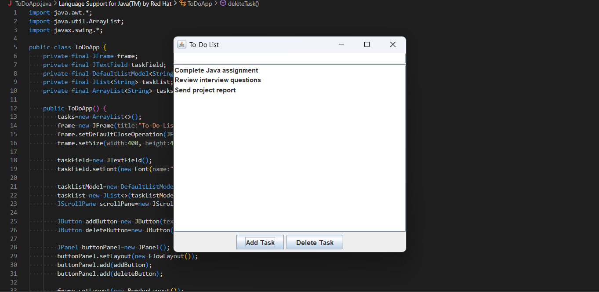

# Java GUI ToDo App

## 📌 Topic Overview
This project is a **To-Do List application** built in Java using the Swing GUI toolkit.  
It allows users to manage daily tasks through a simple graphical interface with options to **add** and **delete** tasks.

## 🎯 Objective
The objective of this project is to implement a **Java-based GUI** that helps users keep track of their tasks efficiently.  
The app provides a user-friendly interface where tasks can be added to a list and removed when completed.

## ✅ What I Have Done
- Created a **JFrame-based** window to hold all components.
- Used **JTextField** for task input.
- Added **Add Task** and **Delete Task** buttons to manage the list.
- Used a **DefaultListModel** with **JList** to store and display tasks dynamically.
- Implemented **event handling** so clicking buttons updates the list in real-time.
- Tested the application to ensure smooth functionality without errors.

## 📷 Screenshot

